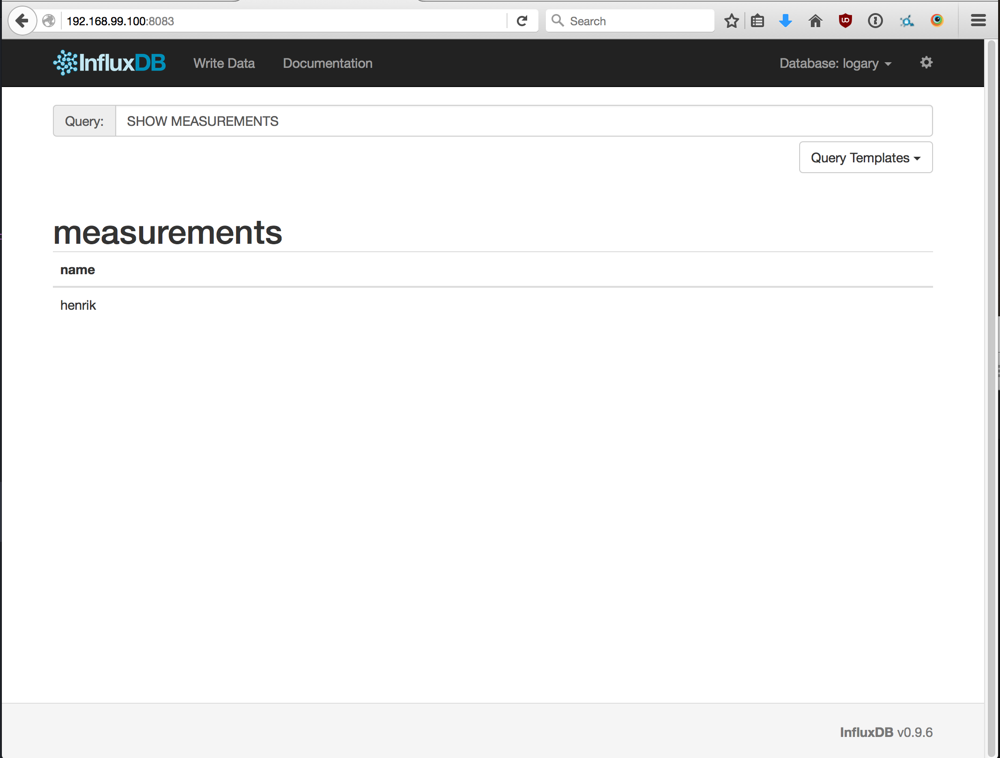
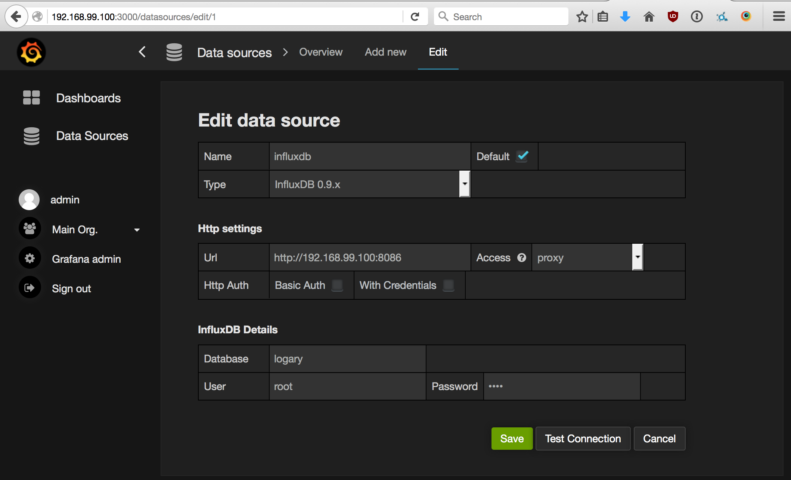
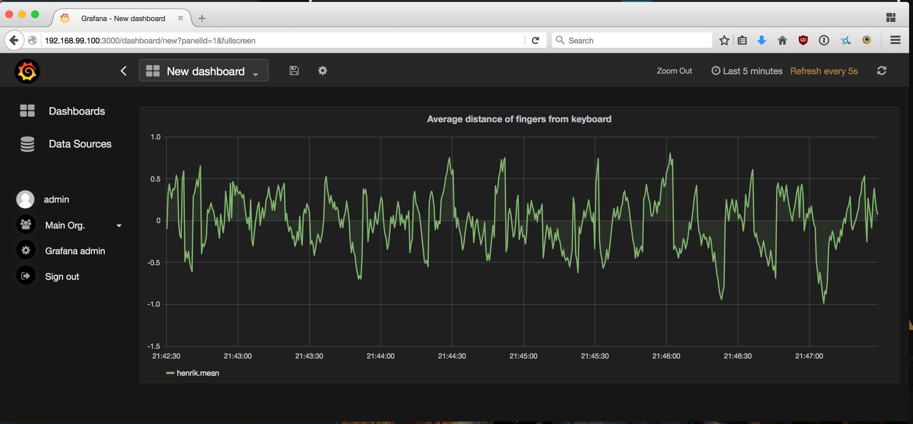

- title: Micro-services with F#
- description : Introduction to micro-services and concepts in F#
- author : Henrik Feldt
- theme : night
- transition : default

***

# Micro-services, docker, logary with F#

*oh my*

***

## Tonight is the Night

*of the metered micro-service*.

***

### This presentation

 - my take on micro-services
 - about F# as a language for distributed computation
 - demo: InfluxDB-metrics from Logary on Docker

> **Henrik's Law**: any distributed application that can be written in F#, will eventually be written in F#.

<aside class="notes">
  Misquoted?
</aside>

***

### @haf – very pro indeed

 - distributed systems affectionado
 - 12 years XP
 - 8.2x programmer for sure
 - *The philosopher of software*

---

### @haf – my work

 - CEO and founder of [qvitoo.com](https://qvitoo.com)
 - content partner at [fsharp.tv](https://fsharp.tv)
 - coauthor of [Suave.io](https://suave.io) with [@ademar](https://github.com/ademar)
 - author of [Albacore v2.0](https://github.com/Albacore/albacore/wiki)
 - author of [Logary](https://github.com/logary)
 - dabble a bit with [docker-fsharp](https://github.com/fsprojects/docker-fsharp)

***

## About micro services

Organisations

<aside class="notes">
  Micro-services are a lot about scaling organisational structures. As the number
  of people in the organisation grows, it becomes exponentially hard to communicate
  with everybody.

  Micro-services let you specify invariants that you hide behind an API contract
  and possibly an SLA.

  Tech reflects your organisation. You build micro-services to be able to work
  faster within your organisation, because there are fewer contention points then.
</aside>

---

## About micro-services

High Availability

---

## About micro-services

Redundancy

<aside class="notes">
  If a single node fails you can fall over to another.

  Multiple requests, take fastest.
</aside>

***

## Trouble in Paradise

Asynchronocity

<aside class="notes">
  You may never get replies.

  Method invocations are replaced with timeouts.

  Monitoring replaces reasoning with types.
</aside>

---

## Trouble in Paradise

The [FLP impossibility proof](http://the-paper-trail.org/blog/a-brief-tour-of-flp-impossibility/)

---
## Trouble in Paradise

Interleaved execution

---
## Trouble in Paradise

<aside class="notes">
  Leads to interleaved logs.

  State can be hard to reason about.
</aside>

***

## How to mitigate?

 - DevOps – your code in production is yours
 - Logging (beginner)
 - Metrics (intermediate)
 - Tracing (advanced)

<aside class="notes">
  I'm gong to focus on metrics this presentation.
</aside>

***

## Demo

Setting up Logary with InfluxDB

---

---

---

***

## Questions

***

## Stay in Touch

 - [try qvitoo.com – free for now](https://qvitoo.com)
 - [twitter.com/henrikfeldt](https://twitter.com/henrikfeldt)
 - [learn more F#](https://fsharp.tv)
 - [chat about Logary](https://gitter.im/logary/logary)
 - [github.com/haf](https://github.com/haf)
